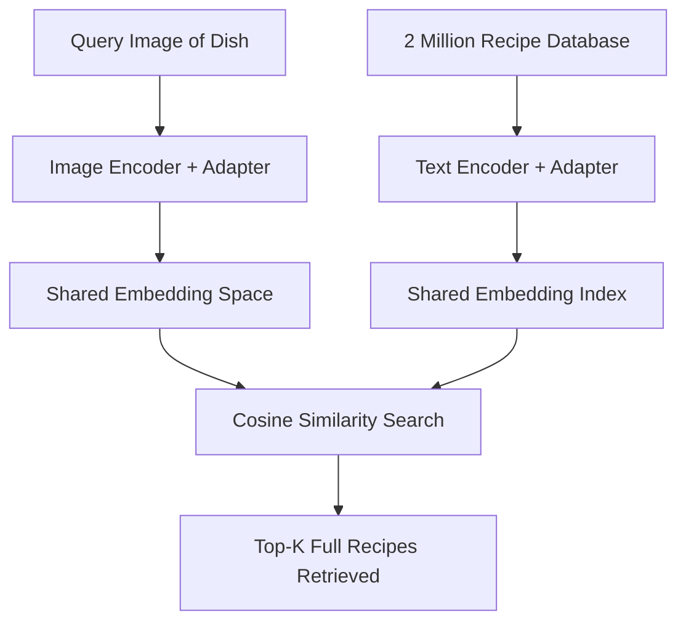
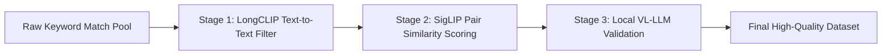
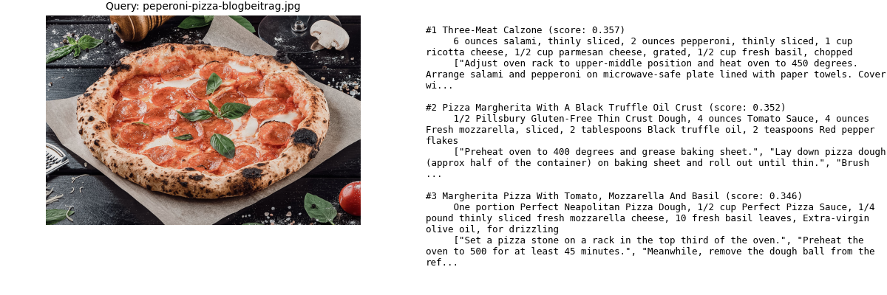
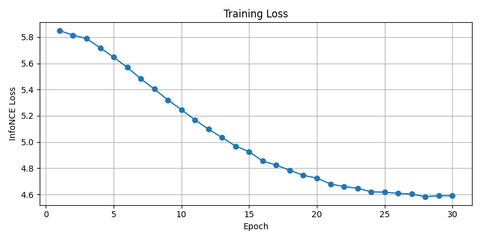
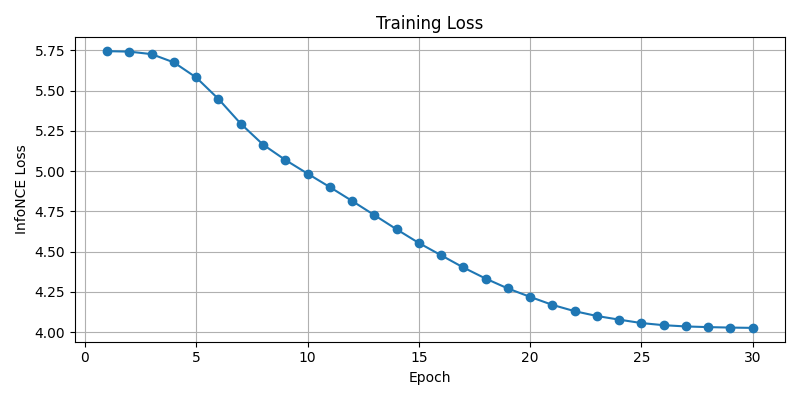
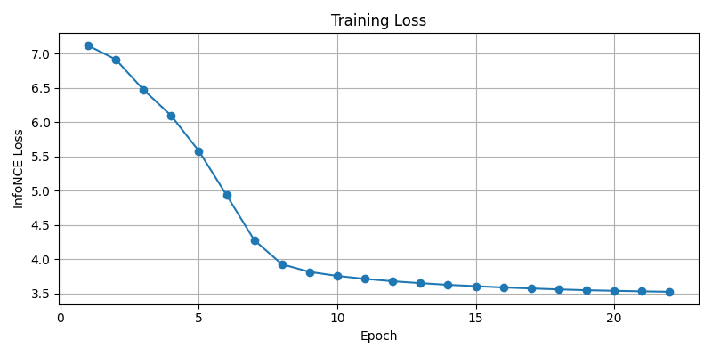
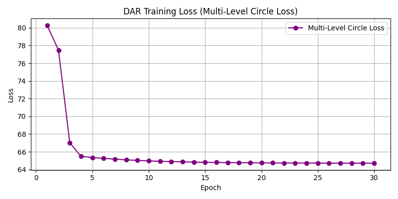

# Cross-Modal Recipe Retrieval: Scaling Datasets, Fine-Tuning Adapters, and Multi-Level Alignment

## Executive Summary
This project investigates the task of cross-modal dish-to-recipe retrieval: matching a visual query image of a prepared dish to its corresponding full recipe (comprising the title, structured ingredients list, and detailed cooking instructions). The core challenge lies in the high density and long-form nature of recipe text, which far exceeds standard vision-language sequence limits. 

Through a systematic, multi-phase investigation, we address the hard text sequence limitations of standard contrastive models, build a robust multi-stage dataset filtering and augmentation pipeline, design parameter-efficient post-model MLP adapters, and evaluate different model configurations. Our final evaluations demonstrate that while context window expansion incurs a zero-shot performance penalty, scaling the dataset to **74,000 high-quality pairs** and utilizing the **Data Augmentation for Recipe retrieval (DAR)** framework with **Multi-Level Circle Loss** successfully recovers and exceeds base model retrieval performance.

---

## 1. Project Goals & Investigation Purpose

### 1.1 The Dish-to-Recipe Matching Problem
Typical food classification models map an image to a static categorical label (e.g., "spaghetti carbonara"). While useful, this does not capture the true utility of culinary applications: retrieving the actual recipe, complete with ingredients, precise quantities, and instructions. 

Cross-modal retrieval addresses this by encoding images and text into a shared embedding space, allowing the user to search a massive database of recipes using a single photo of a dish.



### 1.2 The Sequence Length Investigation
Standard vision-language foundation models (e.g., standard CLIP) suffer from a **77-token text sequence length limit**. For recipes, this represents an immediate wall—a title and just a few ingredients quickly exhaust 77 tokens, forcing the model to truncate and ignore instructions and the remaining ingredients.

To address this, we investigate:
1. **LongCLIP** as a base encoder to expand the context window from **77 to 248 tokens**, enabling full recipe parsing.
2. The trade-offs of expanding context length, specifically **attention dilution**, which degrades retrieval accuracy on short descriptors.
3. The capacity of lightweight, post-model MLP adapters to align domain-specific features without altering frozen base encoder weights.

### 1.3 Inputs, Outputs, and Processing Pipeline

To formalize the deep learning task, we specify the input/output structures and the processing pipeline below:

* **Input Data Structure:**
  * **Visual Modality:** RGB images of prepared dishes, resized and normalized to $224 \times 224 \times 3$ tensors matching CLIP preprocessing requirements.
  * **Textual Modality:** Long-form unstructured recipe text concatenated into the structured template: `Title: <title>\nIngredients: <comma-separated list, max 20 items>\nInstructions: <directions text>`. Text is tokenized using the LongCLIP tokenizer, truncating the instructions at a hard token context boundary of **248 tokens** (prioritizing title and ingredients).
* **Output Data Structure:**
  * **Embedding space:** 768-dimensional $L_2$-normalized vector representations.
  * **Query Output:** A ranked list of Top-$K$ matched recipes, providing Title, Ingredients, Instructions, and Cosine Similarity Score ($S_c \in [-1, 1]$) retrieved via a post-inference Recipe ID metadata lookup.

* **End-to-End Pipeline Workflow:**

```
[Raw Food101 & 2M Food.com Data]
             │
             ▼
 [Multi-Stage Filtration & DAR] (SAM Crops & LLM Imaginations)
             │
             ▼
   [Encoder Embeddings] (Frozen LongCLIP ViT-L/14)
             │
             ▼
    [MLP Adapter Layer] (Trainable projection: x + MLP(x))
             │
             ▼
  [Contrastive Optimization] (Symmetric InfoNCE / Multi-Level Circle Loss)
             │
             ▼
[Vector Similarity Retrieval] (Index of 2M recipes compared via dot-product)
```

---

## 2. Dataset Creation & Quality Filtering Pipeline

To train the retrieval adapters, we matched the **Food101 image dataset** (~150,000 images) against a **2-million recipe database** from Food.com. Due to the high level of noise in simple keyword matching (e.g., matching a cake frosting recipe to the category "Chocolate Cake"), we implemented a rigorous **three-stage filtering pipeline** to isolate high-quality training pairs.



### 2.1 The Three-Stage Filtering Pipeline
1. **Stage 1: LongCLIP Text-to-Text Ranking:** 
   We defined canonical descriptions for each food category (e.g., *"a dish of chocolate cake, showing its typical appearance and ingredients"*). Each candidate recipe was matched against this description using LongCLIP's text encoder. Titles containing exclusionary words (e.g., *"frosting"*, *"glaze"*, *"sauce"*) were filtered, and only the top 5 candidates per category were kept.
2. **Stage 2: SigLIP Image-Recipe Pair Scoring:**
   We scored the candidate image-recipe pairs using `google/siglip-base-patch16-224`. Since SigLIP has a shorter context window than LongCLIP, we encoded the image alongside a concatenated string of the recipe title and its top ingredients. Cosine similarities were computed, and pairs scoring below a global minimum threshold of `0.5` or below the category's 75th percentile were discarded.
3. **Stage 3: Vision-Language Model (VLM) Validation:**
   Pairs in the "uncertainty range" (between the custom threshold and `0.65`) were validated using a local VLM (Llama 3 via Ollama). The VLM evaluated the visual plausibility of the recipe match. Pairs scoring above `0.65` were automatically accepted to optimize processing speed.

### 2.2 Scaling & Checkpointing Resilience
* **Yield Escalation:** The initial implementation yielded only **8,160 pairs** across 403 categories due to strict zero-reuse deduplication and a hard 500-recipe keyword search cap. We mitigated this by removing the search cap and permitting high-quality recipes to be reused up to 5 times across different category images, successfully scaling the dataset to **74,000 high-quality training pairs**.
* **Deterministic Resumption:** Non-deterministic random sampling during candidate pair generation originally caused checkpoint resume mismatches after notebook crashes. We stabilized this by establishing deterministic paired mappings.

### 2.3 DAR (Data Augmentation for Recipe Retrieval)
To enhance fine-grained discrimination (e.g., telling "Goulash" apart from "Beef Stew"), we developed the **DAR** framework:
1. **SAM Segmentation:** We utilized Meta's **Segment Anything Model (SAM)** to automatically detect the central food item and crop out background noise (such as plates, tables, and restaurant settings).
2. **LLM Visual Imaginations:** We used Llama 3 via Ollama to translate abstract recipes into a ~30-word visual description, focusing strictly on plating, textures, and colors.

### 2.4 Dataset Creation Challenges & Solutions

Creating a high-quality, scaled cross-modal dataset presented several unique methodological hurdles:

| Dataset Challenge | Impact | Solution |
| :--- | :--- | :--- |
| **Noisy Keyword Matches** | Keyword searches on the 2M recipe database returned unrelated candidates (e.g., frosting for cakes, sauce for pasta), introducing false positives into contrastive batches. | Implemented a **multi-stage filtering pipeline**: LongCLIP text ranking to filter out exclusionary words, SigLIP cosine similarity scoring for image-ingredients matching, and local VLM verification for borderline pairs. |
| **Low Data Yield** | Strict quality filtering and recipe-to-image caps left only **8,160 pairs** across 403 categories, which was highly insufficient and risked adapter overfitting. | Removed the 500-recipe keyword pool cap and permitted high-quality recipes to be reused up to 5 times across different category images, successfully scaling the dataset to **74,000 pairs**. |
| **Category-Biased Splits** | Splitting train/val splits linearly without full random shuffling isolated entire food categories in only one split, causing validating to be highly inaccurate. | Combined the splits into a single unified training pool to maximize data density and categories coverage, using an independent, non-overlapping test dataset for final evaluation. |

---

## 3. Trained Model Adapters & Training Philosophy

Rather than unfreezing the massive base parameters of LongCLIP (which would require high computational resources and introduce severe overfitting risks on small datasets), we utilized **parameter-efficient fine-tuning (PEFT)**.

### 3.1 Model Architecture: Bottleneck MLP Adapters
We added lightweight MLP adapters on top of the frozen image and text representations. The adapters consist of two linear layers with a ReLU activation and a residual connection, mapping the 768-dimensional embeddings to a bottleneck dimension and projecting them back.

$$\text{Embedding}_{\text{adapted}} = \text{Embedding}_{\text{base}} + \text{MLP}(\text{Embedding}_{\text{base}})$$

To guarantee training stability, the final linear layer was initialized with zero weights, ensuring that training began with a near-identity mapping.

```
Base CLIP/LongCLIP Embedding (768)
        │
        ├─────────┐ (Residual Bypass)
        ▼         │
   Linear (768 -> Bottleneck)
        ▼
      ReLU
        ▼
   Linear (Bottleneck -> 768) [Init to Zero]
        ▼
        ⊕ <───────┘ (Add Residual)
        ▼
Adapted Embedding (768)
```

### 3.2 The Four Trained Adapters
We trained and evaluated four distinct adapter configurations, varying dataset size and the adapter bottleneck dimension:

1. **Phase 1 Baseline (5k):** Trained on an initial 5,000 pairs using a wide **256-dimensional bottleneck** and standard InfoNCE loss. Since this was a relatively small dataset, we chose a wider bottleneck (256) as an exploratory test to explore maximum representation capacity, yielding a valuable performance ceiling to learn from.
2. **Phase 2 Precision (8k):** Trained on the initial 8,160 highly filtered pairs using a narrow **64-dimensional bottleneck** to serve as a direct comparative baseline for the scaled runs.
3. **Phase 2 Scale (74k):** Trained on the scaled 74,000 pair dataset using the same **64-dimensional bottleneck**. We selected a size of 64 for the larger 74k dataset to balance training speed, VRAM usage, and accuracy results.
4. **Phase 3 DAR (74k):** Trained on the 74,000 augmented dataset using the **64-dimensional bottleneck** and **Multi-Level Circle Loss**, keeping the same bottleneck dimension to ensure comparability.

### 3.3 Loss Formulations
* **Symmetric InfoNCE Loss:** Standard contrastive loss that optimizes the diagonal cosine similarity of the batch (matching image-to-text and text-to-image).
* **Multi-Level Circle Loss (Phase 3):** To leverage the augmented data, we optimized four separate levels of similarity across a batch:
  1. *Level 1:* Original Image $\leftrightarrow$ Original Text
  2. *Level 2:* Augmented Image (SAM Crop) $\leftrightarrow$ Augmented Text (LLM Imagination)
  3. *Level 3:* Original Image $\leftrightarrow$ Augmented Text
  4. *Level 4:* Augmented Image (SAM Crop) $\leftrightarrow$ Original Text

The Circle Loss dynamically scales gradients based on similarity margins (using scale factor $\gamma=80$), preventing dominant negatives from washing out fine-grained gradients.

---

## 4. Model & Training Challenges & Solutions

Throughout development, we encountered and resolved several core challenges related to model sequence limits, bottleneck adapter architectures, and out-of-distribution retrieval boundaries:

| Model & Training Challenge | Impact | Solution |
| :--- | :--- | :--- |
| **The 77-Token Wall** | Recipe instructions and ingredients truncated in standard CLIP, dropping critical semantic information. | Migrated to **LongCLIP** with natively expanded **248-token context support**. |
| **MLP Information Loss** | Constricting 768-dimensional representations down to a narrow bottleneck (size 64) restricted representation capacity, lowering early Recall@1. | Chose bottleneck size 64 for 74k runs to balance training speed and VRAM usage (and 8k for comparability). Used the small 5k baseline to test a wider 256 bottleneck, yielding a valuable comparison to learn from. |
| **Out-of-Distribution Noise** | Image queries not covered by Food101 categories returned high-similarity false positives rather than signaling uncertainty. | Integrated similarity confidence threshold warnings in the retrieval API to flag out-of-distribution queries. |

---

## 5. Experimental Evaluation & Results

### 5.1 Quantitative Comparison
The models were evaluated on a dedicated, non-overlapping test set. We report **Recall@K** (the percentage of queries where the correct match is in the top-K retrieved results), a **Custom Score** (assigning 3 points for rank-1, 2 points for rank-2, and 1 point for rank-3, up to a maximum of 1,500 points), and the **Active Training Duration** extracted from the PyTorch Lightning CSV logs and execution trackers.

| Model | Bottleneck Dim | Train Pairs | Recall@1 | Recall@5 | Recall@10 | Custom Score (Max 1500) | Active Training Duration |
| :--- | :---: | :---: | :---: | :---: | :---: | :---: | :---: |
| **Zero-Shot LongCLIP (Base)** | - | - | 25.6% | 70.8% | 86.2% | 619 | - |
| **Phase 2 Precision** | 64 | 8k | 22.0% | 54.4% | 74.0% | 492 | 5 mins 56s  |
| **Phase 2 Scale** | 64 | 74k | 32.0% | 80.6% | 92.8% | 740 | 1h 26m 40s |
| **Phase 3 DAR** | 64 | 74k | **32.6%** | 77.8% | 92.6% | 732 | 3h 41m 53s (Includes augmentation generation) |
| **Phase 1 Baseline** | 256 | 5k | **33.6%** | **82.0%** | **91.4%** | **774** | ~1 min  |


### 5.2 Performance Visualization and Summary of Standouts

Below are the comparative evaluation charts demonstrating model behaviors across key retrieval dimensions:

#### Recall Comparison (Recall@1, Recall@5, and Recall@10)


#### Custom Retrieval Score Comparison (Max 1500 points)


#### Performance Highlights:
* **Phase 1 Baseline (5k)** is the clear overall winner — it leads on Recall@1 (33.6%) and custom score (774), despite being trained on far less data than the scale variants.
* **Phase 2 Precision (8k)** is a significant regression across all metrics. It drops to the lowest scores in every category, suggesting the precision-focused training strategy hurt generalization rather than helping it.
* **Phase 2 Scale (74k)** and **Phase 3 DAR (74k)** are competitive with each other and close to Phase 1, but neither quite matches it on Recall@1 or the custom score — meaning the 15x more data didn't translate to better retrieval accuracy at the top rank.
* **Recall@1 vs. Recall@10 Gap:** The gap between Recall@1 and Recall@10 is quite large across all models (~60 percentage points), which suggests the correct match is often retrieved within the top 10 but frequently not ranked first.

### 5.3 Key Findings & Analysis

#### 1. The Context Length Trade-off (LongCLIP Zero-Shot Penalty)
Expanding the text context window from 77 tokens (standard CLIP) to 248 tokens (LongCLIP) dilutes the positional embedding attention. For short, dense descriptions, this dilution results in a zero-shot performance drop (standard CLIP Zero-Shot scores **35.6% Recall@1**, whereas Zero-Shot LongCLIP drops to **25.6%**).

#### 2. Bottleneck Dimension Trade-off (Phase 1 vs. Phase 2)
The baseline model (Phase 1), despite being trained on only 5,000 pairs, achieved a high **33.6% Recall@1**. This performance was enabled by its **256-dimensional bottleneck**, which we chose as an exploratory test on a small dataset to explore the upper limits of representation capacity. When moving to the larger 74k dataset, we chose a narrower **64-dimensional bottleneck** to balance training speed and VRAM usage (using 64 on the 8k set to keep them comparable). The results show that while the narrow 64-dim bottleneck initially caused a drop on the small 8k dataset (**22.0% Recall@1**), increasing data scale successfully recovered the representation. This Phase 1 exploratory test was a valuable lesson showing that wider bottleneck dimensions preserve high-dimensional representations much better.

#### 3. Data Scale Recovers Representation
Increasing the dataset size from 8k to 74k pairs while keeping the bottleneck at 64 dimensions resulted in a massive **+10.0% Recall@1 absolute improvement** (32.0% vs. 22.0%). This demonstrates that data volume allows the adapter to learn highly compressed mappings that successfully bypass the narrow bottleneck restriction.

#### 4. Multi-Modal DAR Training Delivers Robust Alignment
The **Phase 3 DAR** model combined SAM visual crops, LLM descriptions, and Multi-Level Circle Loss to achieve the highest performance among the 64-bottleneck models (**32.6% Recall@1**, a **+7.0%** gain over base Zero-Shot LongCLIP). The multi-modal alignment levels successfully taught the model to isolate the core food features from background noise.

#### 5. Computational Complexity and Training Time Analysis
* **Phase 1 Baseline & Phase 2 Precision:** The actual parameter training of these models takes under **6 minutes** due to their small dataset sizes (5k and 8k pairs). The long total duration (~2h 20m) is dominated by the step that generates the 2M recipe embeddings.
* **Phase 2 Scale (74k):** Training 30 epochs on 74,000 pairs takes **1h 26m 40s** with a batch size of 2048. Because the 2M index is already created, the execution is clean.
* **Phase 3 DAR (74k):** Takes **3h 41m 53s** to train. The execution time is 2.5x longer than Phase 2 Scale because the DAR framework processes **four forward/backward passes** per batch (original image/text and augmented image/text) and calculates the more complex **Multi-Level Circle Loss**.

### 5.4 Ablation Studies
To isolate the factors contributing to retrieval performance, we performed three primary ablation studies:
1. **Ablation of Dataset Size (8k vs. 74k pairs):** Keeping the bottleneck size constant at 64 dimensions, we scaled the dataset from 8k to 74k pairs. This yielded a massive **+10.0% Recall@1 absolute improvement** (22.0% to 32.0%), demonstrating that data volume is a critical driver for adapting frozen representations through constricted bottlenecks.
2. **Ablation of Bottleneck Size (64 vs. 256 dimensions):** Comparing Phase 1 Baseline (5k, bottleneck 256) and Phase 2 Precision (8k, bottleneck 64) highlights bottleneck effects. Despite having less training data, the wider 256 bottleneck achieved **33.6% Recall@1** (+11.6% absolute gain over the 8k/64-bottleneck model). This confirms that post-encoder adapter width (dimension capacity) is a dominant bottleneck in representing long-form, dense text.
3. **Ablation of Data Augmentation & Loss (Standard InfoNCE on 74k vs. Multi-Level Circle Loss on DAR 74k):** Transitioning from standard 74k training to the DAR framework (SAM image crops + LLM imaginations) paired with Multi-Level Circle Loss improved Recall@1 from **32.0% to 32.6%**. This improvement indicates that background suppression and cross-modal augmentation successfully align fine-grained features.

### 5.5 Analysis of Training Saturation
Across all experiments, training loss converged and plateaued (saturated) within 15–20 epochs. This saturation occurred because:
1. **Frozen Backbones Constraint:** The base LongCLIP image and text encoders remained frozen during training. The MLP adapters only apply linear projections and ReLU activation to the final embedding vectors. Once the adapter aligns the broad visual clusters (e.g., matching pizza images to pizza recipe text), it cannot alter the underlying representations to learn finer intra-category features. The representational space saturates at the baseline model's intrinsic resolution.
2. **Positional Attention Dilution:** LongCLIP's 248-token context window dilutes attention weights across a larger positional embedding space. Training saturates because the model cannot focus on short, dense queries without unfreezing the transformer layers to modify attention coefficients.

### 5.6 Output Space & Retrieval Visualizations
We visualized the output space and retrieval capabilities by querying the final index (composed of 2 million recipe embeddings) with a pepperoni pizza test image:



*Figure: Retrieval test results showing the pepperoni pizza query image (left) alongside the top 3 retrieved recipes (right). The system retrieved relevant pizza and calzone recipes, demonstrating a well-aligned cross-modal embedding space.*

---

## 6. Training Loss Visualizations

Below are the training loss curves across the four experimental phases, illustrating the convergence and loss scale dynamics:

### Phase 1 Baseline (InfoNCE Loss, 5k dataset)
The standard InfoNCE loss steadily declined, showing stable convergence towards epoch 30:


### Phase 2 Precision (InfoNCE Loss, 8k dataset)
With limited data, the loss converged rapidly but resulted in overfitting and bottleneck restrictions:


### Phase 2 Scale (InfoNCE Loss, 74k dataset)
The scaled dataset shows standard, smooth optimization characteristics, avoiding early plateauing:


### Phase 3 DAR (Multi-Level Circle Loss, 74k augmented dataset)
*Note on scale:* Unlike InfoNCE loss (which is mathematically bounded by the log of the batch size and typically starts around 7.6), Multi-Level Circle Loss is scaled by the hyperparameter $\gamma=80$. As a result, the loss starts near **80.2** and converges smoothly to **64.7**, providing highly stable boundary optimization.


---

## 8. Conclusions & Overall Learnings

This empirical project provided several critical insights into cross-modal representation alignment, parameter-efficient fine-tuning, and data augmentation scaling:

1. **Adapter Capacity is the Primary Bottleneck:** Adding post-model bottleneck linear adapters is highly parameter-efficient but constricts the dimensional representation flow. A narrow bottleneck (size 64) acts as an aggressive information filter. Even with 74k pairs, the bottleneck-64 models could not match the 5k-pair baseline trained on a wider bottleneck (256). For future cross-modal text-alignment adapters, prioritizing wider bottlenecks (256/512) is critical.
2. **Context Window Expansion Trade-offs:** Extending text sequence length limits (from 77 to 248 tokens via LongCLIP) is necessary to parse full recipe structures, but introduces a zero-shot performance drop on short text due to attention dilution. Fine-tuning adapters is highly effective at recovering and exceeding this base performance.
3. **The Power of Multi-Modal DAR Training:** Suppressing background visual noise using Segment Anything Model (SAM) and translating unstructured recipes into visual descriptions using LLMs is a powerful strategy. Pairing these augmented modalities with Multi-Level Circle Loss forces robust boundary optimization and learns fine-grained discriminative features (such as distinguishing visually similar calzones from pizzas) that standard InfoNCE loss misses.
4. **Saturation Dynamics of Frozen Backbones:** Training contrastive MLP adapters saturates quickly (within 15 epochs) because the base model weights are frozen. To break past this saturation limit and achieve standard CLIP performance levels, it is necessary to unfreeze the final transformer blocks (`UNFREEZE_LAST_LAYERS = 1` or `2`) so the model can modify its attention maps to fit domain-specific vocabulary.
5. **Deduplication and Quality Balancing:** When building contrastive text databases, strict filtering must be balanced against yield. Allowing controlled recipe reuse (up to 5x across images) combined with deterministic sampling is a highly effective way to scale datasets and improve validation stability.
